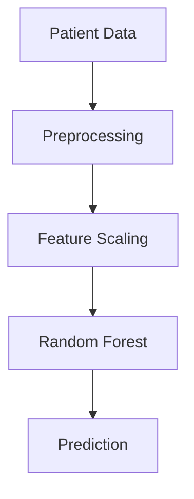
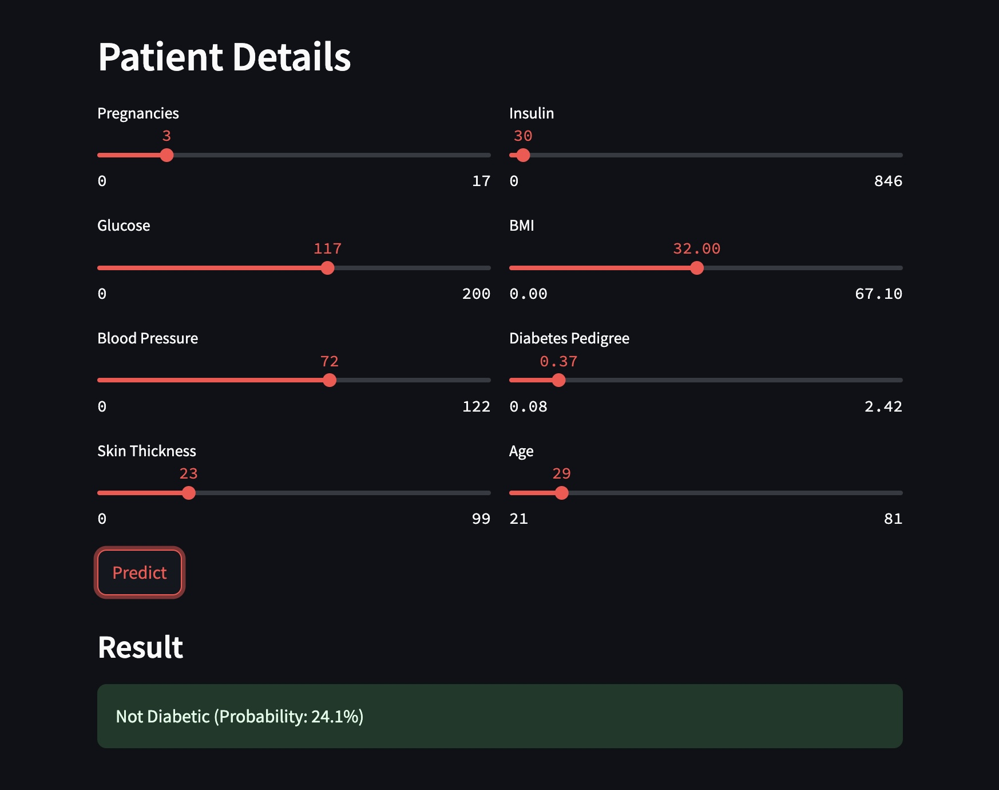

# Diabetes Prediction System 🩺


## 🌟 Features
- 78% accurate prediction model
- User-friendly web interface
- Real-time probability visualization
- Input validation for health metrics
- Mobile-responsive design

## 🚀 Quick Start
### Prerequisites
- Python 3.8+
- pip package manager

### Installation
```bash
git clone https://github.com/Akashka27/Diabetes-Prediction-System.git
cd Diabetes-Prediction-System
pip install -r requirements.txt
```

### Launch App
```bash
streamlit run app.py
```

## 📊 Dataset
**Pima Indians Diabetes Dataset**  
📥 [Download Dataset](data/diabetes.csv)

## 🧠 Model Architecture


## 🖼️ Screenshots



## 🤝 Contributing
Pull requests welcome! Please open an issue first.

## 📜 License
MIT © Akash 


